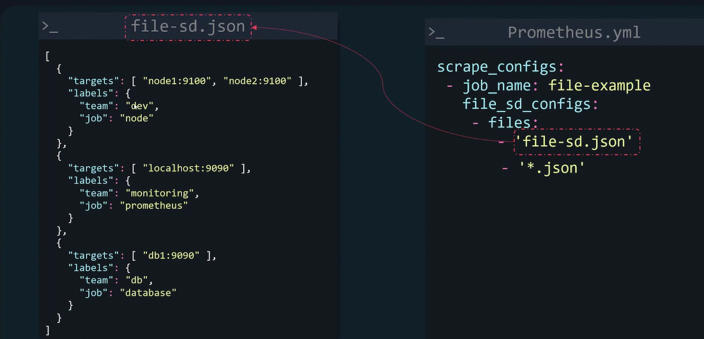
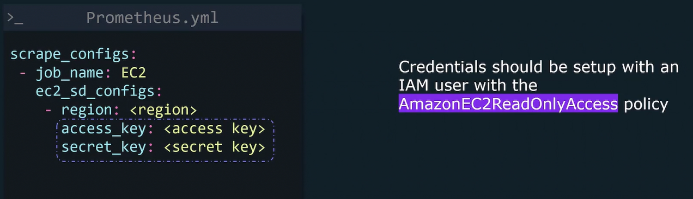
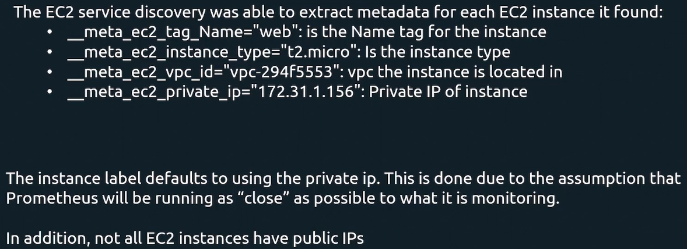
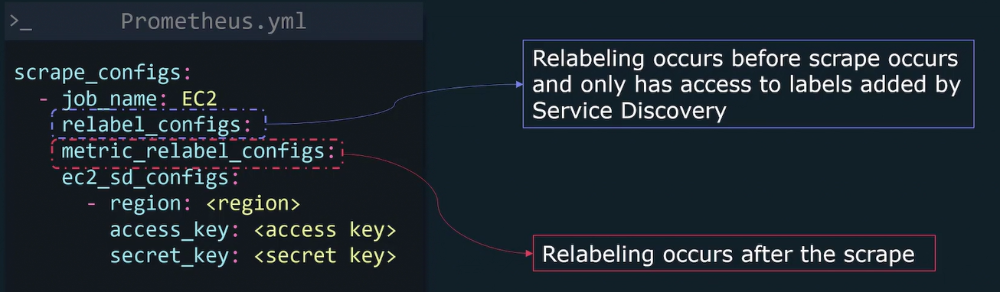
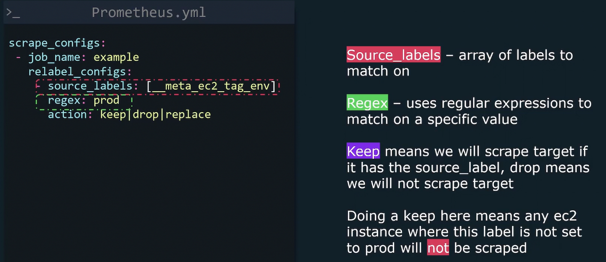

Service Discovery allows Prometheus to populate a list of endpoints to scrape that can get dynamically updated as new endpoints get created and destroyed. Prometheus has built-in support for several service discovery mechanisms like AWS EC2, Azure, GCE, Consul, Nomad, Kubernetes. 

**File Service Discovery**

A list of jobs/targets can be imported from a file. This allows you to integrate with service discovery systems Prometheus doesn't support out of the box. Supports json and yaml. 


**AWS EC2 Service Discovery**

Cloud infrastructure is very dynamic especially when autoscaling is enabled. EC2 Service Discovery makes it so Prometheus has a list of all available EC2 instance to scrape.



**Relabeling**

Relabeling - allows you to classify/filter Prometheus targets and metrics by rewriting their label set.



In this case, Prometheus drop any targets where `{__meta_ec2_tag_env="dev"}`:
```yml
# prometheus.yml
scrape_configs:
- job_name: example
  relabel_configs:
  - source_labels: [__meta_ec2_tag_env]
    regex: dev
    action: drop
```
When there are more that 1 source labels selected, they will be joined by a ";"(semicolon). For example, to match `{env="dev"}` and `{team="marketing"}` use:
```yml
scrape_configs:
- job_name: example
  relabel_configs:
  - source_labels: [env, team]
    regex: dev;marketing
    action: keep
```
To change the delimiter between labels use the separator property. For example:
```yml
scrape_configs:
- job_name: example
  relabel_configs:
  - source_labels: [__meta_ec2_tag_env]
    regex: dev-marketing
    action: keep
    separator: "-"
```
Target labels are labels that are added to the labels of every time series returned from a scrape. For example:
- EC2 instances have label: `__address__=192.168.1.1:80`. Let's say we want to convert this to the following label: `{ip="192.168.1.1"}`. The `action` property should be the name of the new label. regex is set to `(.*):.*` which will assign everything before the ":" (colon) into a group (can be referenced with $1). `replacement` is what the new value of the label should be which is set to $1 which will grab the group from the regex.
```yml
scrape_configs:
- job_name: example
  relabel_configs:
  - source_labels: [__address__]
    regex: (.*):.*
    target_label: ip
    replacement: $1
    action: replace
```
To drop the `__meta_ec2_owner_id` discovery label:
- specify the `regex` to match the desired labels to drop. In this case we want to match on one label, so we can just put the name of the label here.
- for `action`, set it to `labeldrop`
```yml
scrape_configs:
- job_name: example
  relabel_configs:
  - regex: __meta_ec2_owner_id
    action: labeldrop
```
`labelkeep` can be used to specify labels that should be kept. All other labels will be dropped. In this example, only the `instance` and `job` labels will be kept, all other labels will be dropped.
```yml
scrape_configs:
- job_name: example
  relabel_configs:
  - regex: instance|job
    action: labelkeep
```
If we want to keep one or more of these labels, we can use the `labelmap` action. Unlike the `replace` action, the `labelmap` replacement property **modifies the label name** not the value. This example will take all labels that start with `__meta_ec2_` and map them to target labels and prefix them with the `ec2`:
```yml
scrape_configs:
- job_name: example
  relabel_configs:
  - regex: __meta_ec2_(.*)
    action: labelmap
    replacement: ec2_$1
```

**Metric_relabel_configs**
`metric_relabel_configs` occurs after the scrape and has access to scraped metrics. Configuration is identical to `relabel_configs`. To drop a metric called `http_errors_total`:
```yml
scrape_configs:
- job_name: example
  metric_relabel_configs:
  - source_labels: [__name__]
    regex: http_errors_total
    action: drop
```
To rename a metric from `http_errors_total` to `http_failures_total`:
```yml
scrape_configs:
- job_name: example
  metric_relabel_configs:
  - source_labels: [__name__]
    regex: http_errors_total
    action: replace
    target_label: __name__
    replacement: http_failures_total
```
To drop a label named `code`:
```yml
scrape_configs:
- job_name: example
  metric_relabel_configs:
  - regex: code
    action: labeldrop
```
